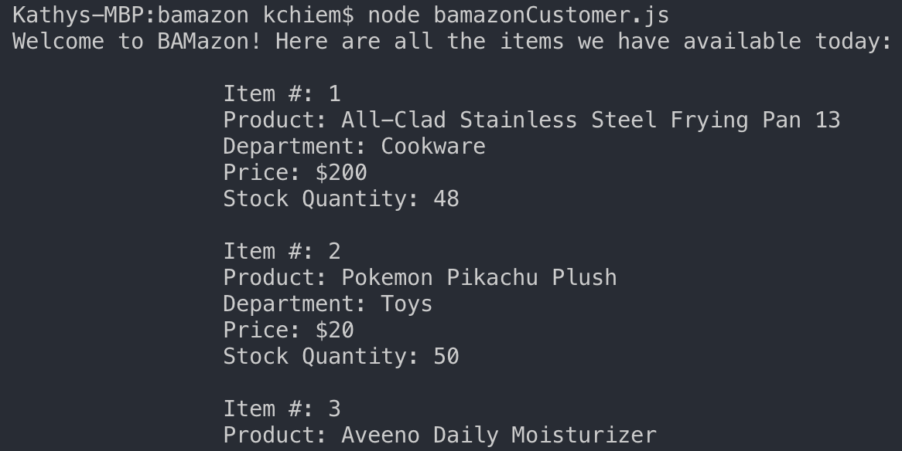
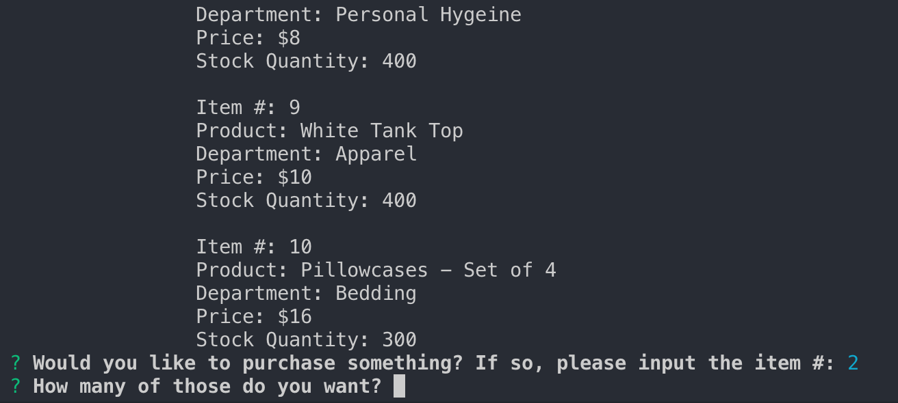
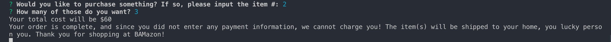
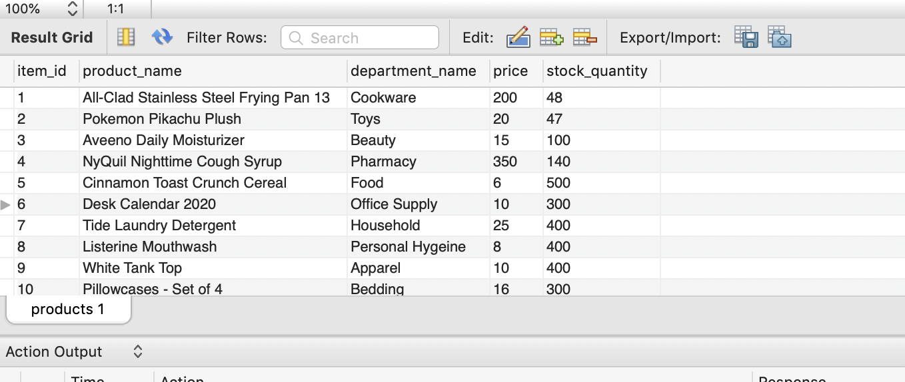

# bamazon

## What is BAMazon?
BAMazon is an Amazon store-like app that utilizes node.js and mySQL to deliver data to you! As a customer, you can interact with this application through your command-line. Please continue reading for instructions on how to use this app.

## User Guide

### Accessing the application
Using your terminal, go into the bamazon folder and enter "node bamazonCustomer.js" into the command-line and run the command.

### Inventory list
The app will return a list of available items and its details, which are pulled from the bamazon database products table.

### Select item
In the terminal, you will be asked to input the item # of the item you would like to purchase. Using you keyboard, you can enter a valid item # and hit return.

### Select quantity
After selecting your item, you will be asked to the quantity you desire. Using you keyboard, you can enter a number and hit return. If you enter an amount exceeding the quantity available, then you will get a message indicating that your amount exceeds our stock and you will automatically exit the app. If you enter a valid quantity, you will purchase the item in the quantity you selected.

### Total cost
You will see your total cost in the terminal along with a message indicating that you have purchased the item.

### Updated BAMazon database
After your purchase, the BAMazon database will be updated to reflect the new stock balances.

